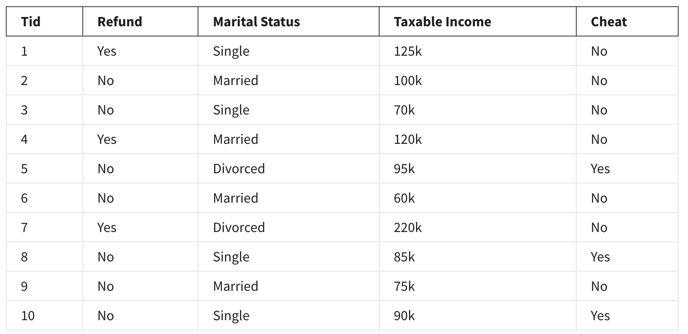

# History and purpose of data mining

## Knowledge check

1. True or False? Discovering a student name in the class roster is an example of a data mining function.
   - False
     - Data mining is to discover (or extract) meaningful, previously unknown, and potentially useful information (or patterns) through exploring and analyzing large quantities of data.
2. True or False? Data mining can only be performed on Big Data.
   - False
     - Data mining can be performed with small data.
3. The following two tasks are examples of which types of data mining tasks respectively? (1) Fraud detection in credit card transactions and (2) Face recognition to unlock smart phones.
   - Deviation Detection and Classification
     - Fraud detection in credit card transactions looks for transaction that deviates from the history and pattern of transactions, and in face recognition, images are classified as belonging to the smartphone owner or not.
4. Why do we extract patterns from data? Select all that apply.
   - To avoid getting stuck with unimportant information
     - Data patterns are extracted so that the burden on the knowledge extraction algorithms is reduced. In any data mining you should consider all parts of the data and should not ignore specific characteristics. Data pattern extraction does not imply removal of characteristic parts of the data.
   - To make knowledge extraction algorithms more efficient.
     - Data patterns are extracted so that the burden on the knowledge extraction algorithms is reduced. In any data mining you should consider all parts of the data and should not ignore specific characteristics. Data pattern extraction does not imply removal of characteristic parts of the data.
   - To find in organizations of data.
     - Pattern recognition is looking to extract how data is organized, and afterwards humans can assign knowledge to these patterns.
5. The following three tasks are examples of which category of data mining tasks respectively?
   1. Movie recommendations on streaming services
   2. Voice recognition in smartphones
   3. Shopping habit extraction on online stores.
   - Predictive, Predictive, Descriptive
     - Predictive tasks predict unknown or future values of some variables. In movie recommendation, we predict which movies the user might enjoy based on their profile and history, and in voice recognition we detect and predict if the received audio has any meaningful words in it and guess what they are. Descriptive tasks find human interpretable patterns that describe the current data. In shopping habits extraction, we describe the patterns in the items that users shop such as shopping together, in the same season, etc.
6. Which one of the following is a predictive data mining task?
   - Learning patterns from existing data and classifying unknown data using the learned pattern
     - Classification is the only predictive task because it can be utilized on unknown data.
7. In a sample data matrix used for a classification task, which elements are available? Select all that apply.
   - Features
     - Patterns are not available in data. Features, data samples, class label vector are available.
   - Data Samples
     - Patterns are not available in data. Features, data samples, class label vector are available.
   - Class Label Vectors
     - Patterns are not available in data. Features, data samples, class label vector are available.
8. If a classification application has D dimensional data samples and N data samples, then what is the dimension of the data matrix?
   - N \* (D + 1)
     - Data samples are in rows. Features in columns. There is one extra column for class label.
9. A high school has provided your company with a database containing a list of student names, IDs, parents’ careers, home address and zip-codes, letter grades and GPA for last year, and their recreational activities. Which of the following tasks would qualify as a data mining task? Select all that apply.
   - Predicting students letter grades and GPA for this year.
     - Data mining is to discover (or extract) meaningful, previously unknown, and potentially useful information (or patterns) through exploring and analyzing large quantities of data. Predicting future grades would be an example of discovering previously unknown information.
   - Analyzing impact of parents’ career on students’ letter grades.
     - Data mining is to discover (or extract) meaningful, previously unknown, and potentially useful information (or patterns) through exploring and analyzing large quantities of data. Analyzing impact of parents’ career would be example of discovering meaningful, unknown, and useful information.
   - Finding link between recreational activities and courses which each student excelled in them.
     - Data mining is to discover (or extract) meaningful, previously unknown, and potentially useful information (or patterns) through exploring and analyzing large quantities of data. Link between recreational activities and courses would be an example of discovering meaningful, unknown, and useful information.

10. What features in the table can be considered class-label vectors? Select all that apply.
    - Refund
      - Except for ID everything else can be considered as class label based on the desired goal. ID is just the identification number of each data sample.
    - Marital Status
      - Except for ID everything else can be considered as class label based on the desired goal. ID is just the identification number of each data sample.
    - Taxable Income
      - Except for ID everything else can be considered as class label based on the desired goal. ID is just the identification number of each data sample.
