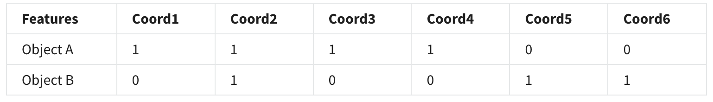

# Review of initial data exploration techniques

## Knowledge check

1. What is correct about similarity measures? Select all that apply.
   - if $p = q$, similarly, s(p, q) is one (or maximum similarity)
     - This is one of the two properties of similarity measures.
   - Simple Matching and Jaccard Coefficients are useful for binary attributes
     - they cannot be used for other type of attributes such as real
2. Which correctly define correlation. Select all that appl
   - Correlation of -1 means that the two vectors have a perfect negative linear relationship
     - If the correlation is -1, the vectors follow the perfect negative linear correlation.
3. n a dataset, samples have two features X and Y, and X is in range of 0 to 5 and Y is 0 to 1. If we have the following point, what is the Euclidean Cell-based Density?

```math
(0.5,0.1), (0.4, 0.4), (1.35,0.41), (3.44, 0.56), (2.26, 0.94), (1.96, 0.23), (3.65, 0.03)
```

- [2,2,1,2,0]
  - Euclidean Cell-based Density counts number of points in each cell of size (1 \* 1). There are 5 cells in this case and for example since there is no point with X value between 4 to 5, in the fifth cell density is zero.

4. What is the range of values for the Cosine similarity metric?
   - [-1 1]
     - Cosine can range from $-1 = Cos (180) to 1= Cos (0)$
5. In a dataset, samples have three real features. For the following points A and B with relation A(i)^3 + B(i) = 30, which similarity measure would not be suitable? Select all that apply. $A = [1, 2, 3], B = [29,21,3]$
   - Correlation
     - Correlation is useful only for linear relation while here we have a non-linear relation between the two features.
   - Jaccard Coefficient
     - Jaccard Coefficient can be used for binary features and not real.
6. How is correlation calculated?
   - using variance values of the two vectors and covariance between them
     - Correlation is covariance of the two vectors scaled with variance of each.
7. Compute the Jaccard coefficient between Object A and Object B.
   - 0.1667


