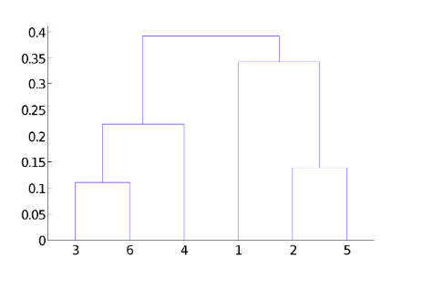

# Non- partitional clustering

## hierarchical clustering

- agglomerative: You start from each point being a cluster. Then you start merging closest pair of clusters.
- Divisive: start with a single cluster and you divide the data to smaller clusters. You saw an example with bisecting k-means.

## Hierarchical clustering (agglomerative)

Set of nested clusters. Can view it in a dendogram.
Dendogram: tree diagram with the merge/split records.

If we have a specific number of clustering, we can cut the dendogram at a desired position. (so instead of 8 clusters, cut at 4)

We can reduce hierarchical clustering into K means (no of clusters)

### Strengths

- Does not have to assume any particular number of clusters
- They may correspond to meaningful taxonomies. It may actually group the data into classes. (observed in biology data)

### Agglomerative algorithm

1. compute the proximity matrix (define distance, manhattan, euclidean) among all points
2. Let each point be its own cluster.
3. repeat as needed:
   1. Merge the two closest clusters
   2. Update the proximity matrix (among clusters instead of points)
4. Stop when you have 1 cluster only.

Key operation: calculating the distance between two clusters

### computing distance between clusters

- MIN: proximity between closest two points in different clusters
- MAX: proximity between farthest two points in different clusters
- Group Average: gets average of all the distances (pairwise proximity) between points in different clusters
- Centroids: calculate centroids on each cluster and calculate distance between them.
- Other methods driven by objective function (Wards method uses squared error)

These are also used in graph theory.

### Proximity matrix

- if distance matrix:
  - symmetric
  - diagonal is zeros

### example... merging with proximity matrix

When updating proximity matrix:

1. Get the lowest distance in prox matrix
2. Merge the points with lowest distance... consider them as 1 new point
3. Select approach to calculate distances between points...
4. Say Max approach, you get the distance of an unmerged point i and merged points i, j
5. Since youre using max, you get the max distance between these two merged points
6. Update proximity matrix with the max distance of the two
7. Rinse and repeat until you merge everything

### Performance analysis

How distance calculation types perform?

- MIN

  - handles non elliptical shapes
  - handles different cluster sizes
  - very susceptible to noise and outliers (will not really do well)

- MAX

  - not susceptible to outliers
  - Not good with different sizes, will try to break the bigger one.

- Group average
  - tries to get the best of both approaches
  - less susceptible to noise and outliers
  - compromise between single and complete links
  - BIASED towards globular clusters. Will try convex shapes to clusters.

time space requirements:

- O(N2) space because you need to store the proximity matrix
- O(N3) time because there are N steps and for each step the N2 prox matrix needs to be searched/updated
  - complexity can be reduced using advanced data structs like sorted list or heap.

## Knowledge check

1. What could be the possible reason(s) for producing two different dendrograms using the agglomerative clustering algorithm for the same dataset?
   - Proximity function used
     - Depending on proximity approach (MIN, MAX, Group Average, …) the resulting dendrograms can be different.
2. In the figure below, if you draw a horizontal line on the y-axis for y=0.2, what will be the number of clusters formed?
   - 4 - Since the number of vertical lines intersecting the red horizontal line at y=0.2 in the dendrogram are 4, therefore, four clusters will be formed.
     
3. Select all strengths of Hierarchical Clustering approaches:
   - They do not have to assume any particular number of clusters
     - Hierarchical clustering approaches do not have to assume any particular number of clusters, Any desired number of clusters can be obtained by ‘cutting’ the dendrogram at the proper level. also They may correspond to meaningful taxonomies.
   - Any desired number of clusters can be obtained by ‘cutting’ the dendrogram at the proper level
     - Hierarchical clustering approaches do not have to assume any particular number of clusters, Any desired number of clusters can be obtained by ‘cutting’ the dendrogram at the proper level. also They may correspond to meaningful taxonomies.
   - They may correspond to meaningful taxonomies
     - Hierarchical clustering approaches do not have to assume any particular number of clusters, Any desired number of clusters can be obtained by ‘cutting’ the dendrogram at the proper level. also They may correspond to meaningful taxonomies.
4. When do we use MAX and MIN metrics?
   - To determine the distance between a point and a cluster
   - To determine distances between clusters
     - MAX and MIN metrics are used to determine distance between clusters, or points and clusters.
5. How do we evaluate MAX distance between two clusters?
   - Compute the distance between any two pair of points, where one point belongs to one cluster and the other belongs to the other. Take the maximum of the distances.
6. Figure 3: Four Faces with Patterned Clustering Regions. Review the image labeled Figure 3: Four Faces with Patterned Clustering Regions. You are asked to cluster the nose, eyes, and mouth regions of the faces in the provided image. Darkness or number of dots represents the density of data, and lines are used only to distinguish regions and do not represent data points. Using complete linkage (MAX) hierarchical clustering, in which faces will the nose, eyes, and mouth be well clustered based on the patterns?
   
   - a, b and c - Complete linkage does not work when there are islands of points separated by huge empty space.
