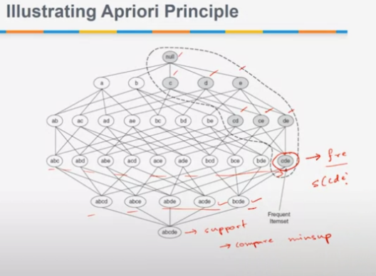
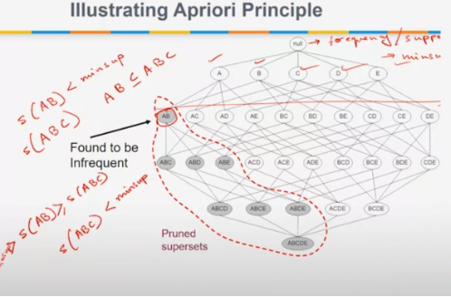
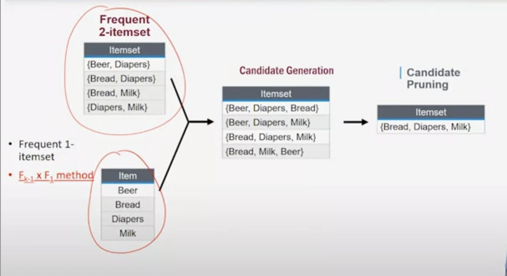
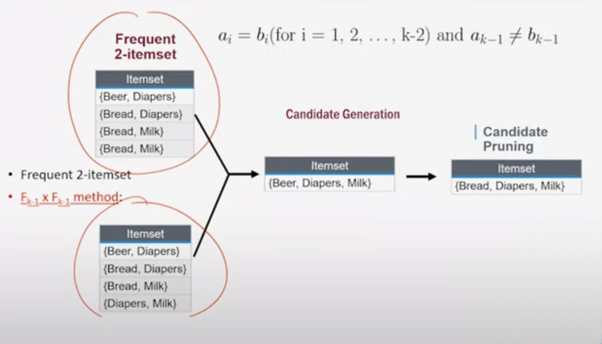
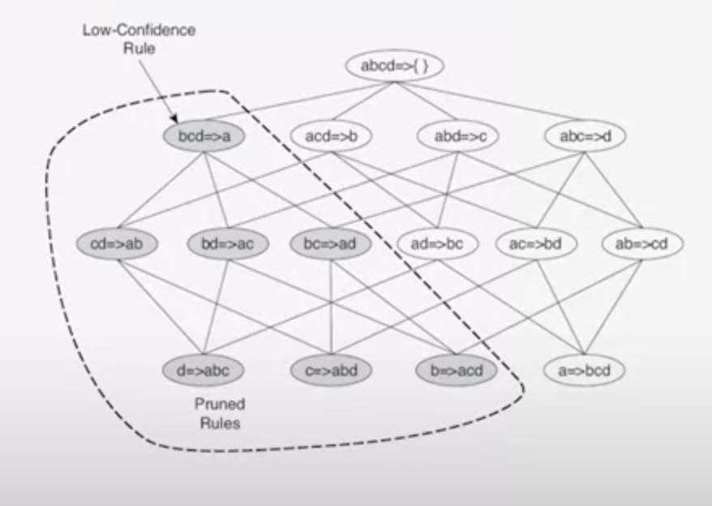

# A priori principle
if an itemset is frequent, then all of its subsets must also be frequent.
$$\forall X,Y: (X\subseteq Y)\Rightarrow s(x) \ge s(Y)$$

$X$ is a subset, and $Y$ is an itemset. $X$ is a subset of $Y$… support of $X$ has to be greater or equal than support of $Y$.

## Bottom-top approach:
1. Go bottom to top and generate itemsets
2. Compare each itemset on each layer with minsup
3. Find an itemset with a high support >= minsup
4. If all the subsets from this itemset will have the same support… then we don’t need to calculate support for them.

<figcaption style="text-align:center;">CDE is frequent… then don’t explore grey region</figcaption>

## Top-bottom approach:
1. Go top to bottom and generate itemsets.
2. Compare each itemset on each layer with minsup
3. Find an itemset with a low support (infrequent)
4. If all the subsets from this itemset will have the same support < minsup… they are all infrequent and you can just prune them

<figcaption style="text-align:center;">AB is infrequent, prune any children</figcaption>

**Both options reduce calculations by a lot.**

## 1. Apriori algorithm

1. Let k=1
2. Generate frequent itemsets of length 1
3. Use apriori to prune part of the lattice that is infrequent
4. Generate k+1 itemsets from k itemsets
5. Repeat until no new frequent itemsets are identified

How do we generate k+1 itemsets from k itemsets?

This algorithm:
- makes a single pass over the data
- generates new candidate k-itemsets using frequent k-1
- algorithm needs to make an additional pass
- **algorithm elimininates all candidate where support < minsup**
- algorithm terminates when no new frequent itemsets generated.

TL;DR:
1. candidate generation
   - generates new candidate k-itemsets using frequent k-1
2. candidate pruning
   - algorithm elimininates all candidate WITH SUPPORT PRUNING STRATEGY

### Issues
- avoid generating too many unnecessary candidates (itemset generated a superset that was infrequent to begin with)
  - example: a, b, c, d... a, d infrequent... so when you generate from b ab or bd, then those were pointless
- candidate set is complete... none of the frequent itemsets should be left out
  - frequent itemset $\subseteq$ candidate set
- you should not generate the same candidate itemset more than once
  - example: from a,b,c,d... b generates bc... and c generates cb

## illustrating apriori principle
<figcaption style="text-align:center;">$F_{K-1}F_1$ method: you get k-1 itemsets and from those you get all the frequent itemsets... then you prune</figcaption>

you can impose alphabetical rules to prevent generating the same thing again and again... so like AB == BA and you only do the first one

<figcaption style="text-align:center;">$F_{K-1}F_{K-1}$ method: take pair of 2-itemsets, where you get same k-2 same but k-1 different, then you march them and prune</figcaption>

## factors affecting complexity
- choice of minimum support threshold
- dimensionality of dataset
- size of database
- avg transaction width (how many rules you have to parse)

### support counting
This is used for pruning, to make things less expensive
- as you build itemsets you increment the support count of the frequent itemsets only.
- Iterative support count will reduce complexity a bit.

## 2. Rule generation
- You get the frequency of ocurrence for every candidate that survived pruning
- compare each transaction against every candidate dataset

Rule {1,2} &rarr; {3} is generated from frequent itemset X={1,2,3}.

Confidence for this rule is $\sigma${1,2,3}/$\sigma${1,2}

Anti-monotone property... if {1,2,3} frequent then {1,2} is frequent.

No such principle for confidence, we need to reduce the no of rules from {1,2,3}.

CONFIDENCE HAS NO MONOTONE PROPERTY.

### theorem
- rule X &rarr; Y-X does not satisfy the confidence threshold.
  - Y-X should not have anything that is in X
- X' is a subset of X. Then X &rarr; Y-X' also does not satisfy confidence threshold.
  - X:{1,2} &rarr; {3} does not satisfy, then
  - X':{1} &rarr; {2,3} does not satisfy

#### proof
$$\frac{\sigma(Y)}{\sigma(X')} \le \frac{\sigma(Y)}{\sigma(X)}$$

Essentially, generate rules... check the confidence threshold. If they don't meet confidence threhsold, don't subdivide that one.

### so the gist is:
1. Take level wise approach to generate rules. 
   1. generate 1 consequent
   2. generate 2 consequents
   3. etc
2. High confidence rules with only 1 item in the rule are extracted first
3. only those rules that satisfy confidence threshold are kept
4. Generate candidate rules from those good ones

### example
<figcaption style="text-align:center;">Do first consequent rule... and prune any consequent rules with low confidence</figcaption>