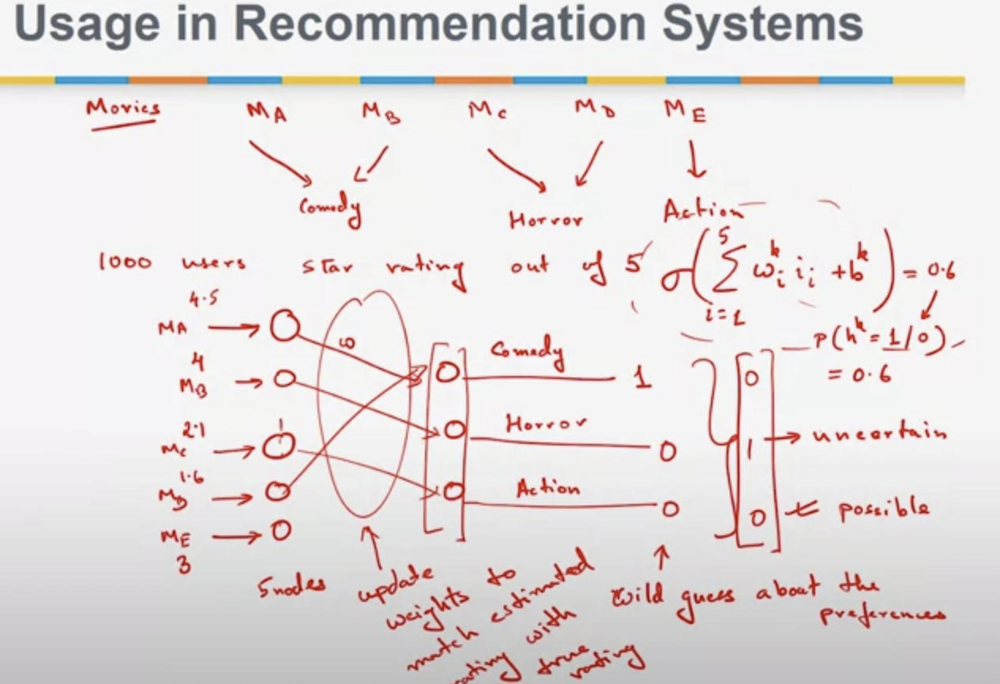

# RESTRICTED BOLTZMANN MACHINE
Naive bayes &rarr; attributes are conditionally independent....
Bayesian networds &rarr; Generalization of the naive Bayes network. Multiple connections with <u>**conditional dependence architecture.**</u>

Instead of a probabilistic approach you can do a linear approach... a belief network.

## Deep belief network
1. you have observable facts at the bottom, and at the top you have potential reasons (beliefs).
2. Given the observable facts we want to find out which beliefs are true.
3. We can have several hidden nodes/beliefs with stochastic outputs. 
4. certain beliefs are associated with each other.

stochastic outputs &rarr; the activation function $\sigma(w_i + b)$ output is a probability that it is either 1 or 0.

Take the output of the activation function as a probability that the output of the node is 1 or 0.

Difficult to learn a belief network
- each hidden layer adds complexity to the system
- you need a lot of data to set it up

<u>**Simplify with a restricted Boltzmann machine.**</u>

Boltzmann machine &rarr; input observable layer + not observable hidden layer. Complete bipartite graph with no edges between nodes.

## Usage in reccomendation systems
- You have movies as input with a classification (comedy, horror, etc).
- The actual input is the star rating of each movie
- You have 3 hidden layers (comedy, horror, action).
- You kinda know that the person likes a particular gender given his/her ratings.
  - **Problem**: maybe user does not like comedy, but really likes a particular actor that shows up.
  - **Outcome**: since actor info not available (user does not share this really), then the output will be uncertain

### Solution
- boltzman machine with weights across neurons, where outputs of nodes are probabilities, so the output of the hidden layer is a wild guess of preferences.
- You reverse the layer and recompute star ratings from output. May be far from the truth... so you do a back-propagation to reduce error in rating estimation (udpate the weights to match estimated and true rating).
- Reverse and do it again... then do the whole thing again and again a thousand times.
- By the end of it you can guess the output of the hidden layer and you get correct the star ratings.
- That means that from the star ratings you can guess the user preferences.

**Essentially we try to convert the wild guess and match it to reality. After enough iterations you will get close to reality.**

