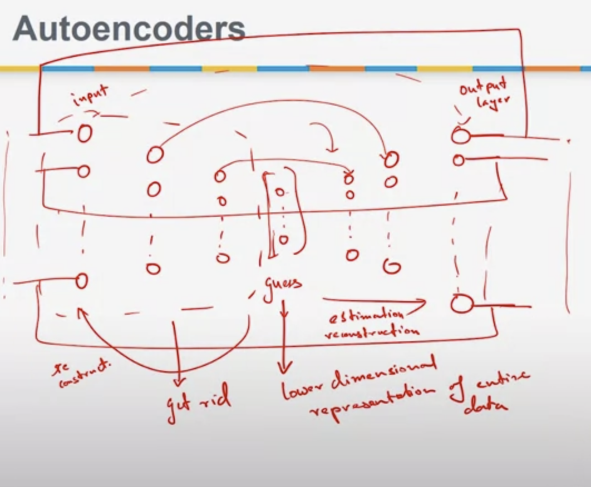

# DEEP NETWORKS FOR PCA
In restricted Boltzmann machines we have an input layer and a hidden layer.
## Stacked RBMS
- We can make things more complicated and replicate the hidden layer, consider it as hidden input layer, and get a smaller hidden layer... and again and again.
- It helps us to guess on different levels... guesses become complex and more cognizant on different bits on the data.

## Autoencoders
- We can make smaller wild guesses from the input... so how about based on the small guess can we reconstruct the input? (going backwards)
- You can take this architecture as a feed forward neural network.
- The expected output is the same as the input.
- If we train this network, we get very complex and learned small guesses that can be used to reconstruct the input back.
- so TL;DR, the lower dimensional guesses represent the entire data and you can ignore the rest of the structure.

**You can then think of this as a principal component of the data.**

