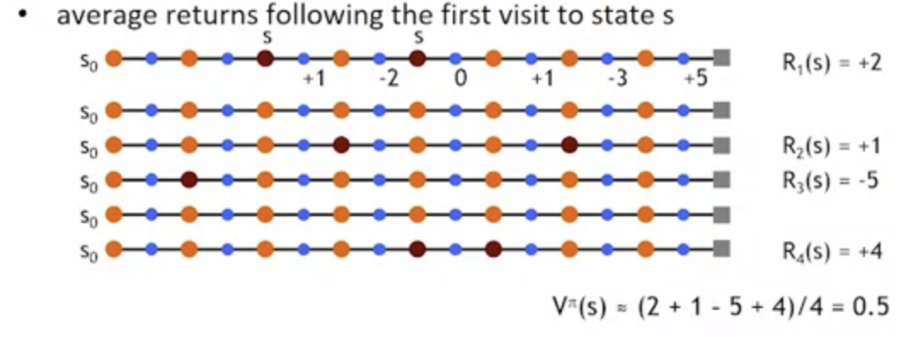

# Dynamic Programming to Solve RL
- main idea:
  - use value fcns to structure the search for good policies
    - Bellman equation... if you can optimize functions then you can optimize overall solution for fcn.
  - need a perfect model of the environment
    - The only unknown is the policy

-  two main components
   -  policy evaluation: compute $V^\pi$ from $\pi$
   -  policy improvement: improve $\pi$ based on $V^\pi$ 

- don't have a policy:
  - start with an arbitrary policy

- repeat evaluation/improvement until convergence

## policy evaluation
$$ \pi \rightarrow V^\pi $$

- Bellmans eqn define a system of n eqn's
- could solve but we will use iterative version
- start with arbitrary value fcn $V_0$, iterate until $V_k$ converges

$$ V_{k+1}(s) = \sum_a\pi(s,a)\sum_{k}P^a_{ss'}[r^a_{ss'}+\gamma V_k(s')]$$

## policy improvement
$$ V^\pi \rightarrow \pi' $$
- for each state we find the best action
$$ \pi'(s) = arg \max_a Q^\pi(s,a) $$

$$ \pi'(s) = arg \max_a\sum_{s'}P^a_{ss'}[r^a_{ss'}+\gamma V^\pi(s')]$$

- For each state we find the best action a... old policy is $\pi$ and new policy is $\pi'$.
- We take state s and try all different possible actions and we find best Q... kind of brute force.
- $\pi'$ is either strictle better than $\pi$, or $\pi'$ is optimal (if $\pi=\pi'$)

## using DP (dynamic programming)
- need complete model of environment and rewards
  - robot in a room
    - state space, action space, transition model

- can we use DP to solve
  - robot in a room? yes
  - backgammon? yes
  - helicopter? no we need to explore new environment

# Monte Carlo Method to solve RL
- you dont need full knowledge of the environment
  - just (a bit) experience or 
  - simulated experience

- needs to be similar to DP
  - policy evaluation, policy improvement (you have both of these steps similar to DP)

- averaging sample returns
  - defined only for episodic tasks

- you start exploring from an arbitrary policy. Then you evaluate n times.

## policy evaluation
- want to estimate $V^\pi(s)$
  - expected return starting from s and following $\pi$.
    - estimate as average of observed returns in state s

- first visit MC
  - average rreturns following the first visit to state s.
  - You start from S0 and count reward starting when you reach S... then follow policy $\pi$ until terminal state.
  - You do this 10,20,50 and get the average, $V^\pi(s)$

## policy improvement
- $V^\pi$ not enough for policy improvement
  - need exact model of the environment
  - You need to iteratively figure out a best policy

- estimate $Q^\pi(s,a)$ (greedy policy)

$$\pi'(s)= arg \max_a(Q^\pi(s,a))$$

- MC control: on every step you get action that gets best reward, we dont care about the future.
    - update after each episode
$$\pi_0 \rightarrow^EQ^{\pi0}\rightarrow^I \pi_1 \rightarrow^EQ^{\pi1}\rightarrow^I...\rightarrow^I\pi^* \rightarrow^EQ^{*}$$
- non-stationary environment
$$V(s) \leftarrow V(s) + \alpha[R-V(s)]$$
- **problem: greedy policy won't explore all actions**

## maintaining exploration
- deterministic/greedy policy won't explore all actions
  - don't know anything about the environment at the beginning
  - need to try all actions to find optimal

- how to maintain exploration?
  - use soft policies instead: $\pi(s,a)>0$ for all s,a

- **$\varepsilon$-greedy policy**
  - with $\varepsilon$ you can do a balance between greedy and random
  - with probability $1-\varepsilon$ perform optimal/greedy action
  - with probability $\varepsilon$ perfrom a random action
  - will keep exploring the environment
  - slowly move it towards greedy policy $\varepsilon \rightarrow 0$

## simulated experience
- simulate playing poker and use that as your experience
- DP: you need to list all states, actions, and compute all probabilities
- MC: you just need a few sample episodes
- let MD play against a random policy, or itself, or another algorithm

## Summary MC
- dont need a model of the environment
  - average of sample returns
  - only for episodic tasks
- learn from sample episodes or simulated experience
- can concentrate on important states
  - dont need a full sweep
- need to maintain exploration
  - use soft policies

# Temporal difference learning
- best of both worlds. Combines ideas from MC and DP.
  - like MC: learn directly from experience (don't need a model)
  - like DP: learn from values of successors

on MC you have to simulate until terminal state is reached... its slow. on DP you have a linear combo of succesor value function.

**It starts like MC but when it evaluates value function it does iterative instead of going to terminal state. It evaluates value fcn every step.**

  - works on continuous tasks, usually faster than MC
- constant-alpha MC:
  - have to wait until the end of episode to update
$$V(s_t)\rightarrow V(s_t) + \alpha[R_t - V(s_t)]$$
- simplest TD
  - update after every step, based on successor
$$V(s_t)\rightarrow V(s_t) + \alpha[r_{t+1} + \gamma V(s_{t+1}) - V(s_t)]$$

- for more info go to ML courses...