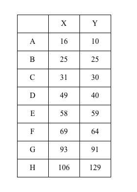
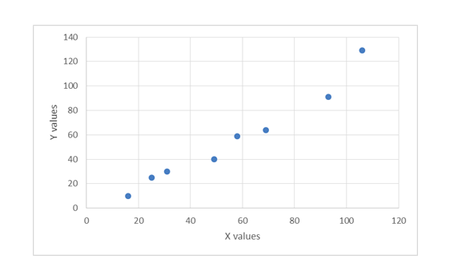

# Week 1: Practice Quiz

1. Select all fields that are directly relevant to data mining, which have influenced breakthroughs in the field.
   - Statistics / Artificial Intelligence
   - Database System
   - Machine Learning / Pattern Recognition
2. Machine Learning / Pattern Recognition
   - Online services and media have become popular and allowed for collection of large amounts of data.
   - Pervasive sensor data collection became more common.
   - Hardware became cheaper and more powerful.

1. What is the Euclidean distance between points (A and B), (D and E), and (G and H)?
   - None of the above
     - 17.49(A and B), 21.02(D and E), 40.16(G and H)
2. Compute cosine similarity between A and B.
   - 0.97
3. Select the most similar correlation value between X axis and Y axis of the given points.
   - 1
     - the exact value would be 0.98 which is very close to perfect positive linear relation at value 1.
4. Select all correct pairs of data attributes type and the appropriate example.
   - Interval – Temperatures such as Centigrade (C) and Fahrenheit (F)
   - Nominal – hair colors
   - Ordinal – order of finishing a running race
   - Ratio – distance between cities in milage
5. Which of the following is not a case of data quality problems?
   - Curse of dimensionality
   - High Sparsity
6. Select all possible use-cases of data mining
   - Credit card fraud detection
   - Automatic Market segmentation into groups based on some similarities
   - Summarization of news
7. You have a dataset with 10 billion records in it, and for preprocessing you have decided to do sample it to reduce amount of computation. How do you know if you have chosen a suitable sample?
   - Sample properties should be similar to properties of dataset.
8. Which of these data mining tasks are predictive?
   - Regression
   - Classification
