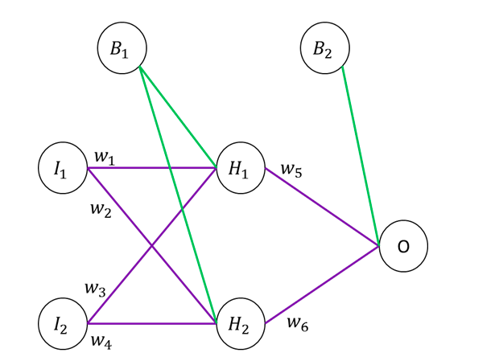

# Knowledge Check: Artificial Neural Networks

1. Which statement is true regarding Artificial Neural Networks?
   - Perceptron is an example of supervised learning algorithm for binary classifiers (two-class classification problems)
     - It is a linear classifier; that is a classification algorithm that makes its predictions based on a linear predictor function combining a set of weights with the feature vector.
2. Which of the following are disadvantages of Artificial Neural Networks (ANN)?
   - Complex and Time-Consuming
   - Gradient Descent can converge into local optimum instead of global ones
   - Neural networks are sensitive to the presence of noise
     - It is difficult to assess the hidden layer operations ANN, which are sensitive to noise.
3. True or False? A perceptron is a linear classifier.
   - True
     - Perceptron decision boundary is a line and can capture linear problems.
4. True or False? A MultiLayer Perceptron (MLP) is a linear classifier.
   - False
     - Since activation functions are further combined for hidden layer inputs, the MLP is a non-linear classifier.
5. What is the core problem solved in training an Artificial Neural Networks (ANN)?
   - Gradient descent
     - It is used to search the parameter space to reduce error by changing the weights at a rate proportional to the differential of the weights.
6. Why do we need backpropagation for Artificial Neural Networks (ANN)? Why not just use perceptron learning algorithm?
   - In ANN, we do not have the true error at each hidden layer
     - Perceptron assumes availability of ground truth at the output. But in ANN we do not have it for the hidden layers.
7. Compute the forward pass for predicted output for O with parameters shown below. Take I1 = 0.05 and I2= 0.1
   i = {1,2}
   
   - 0.75
